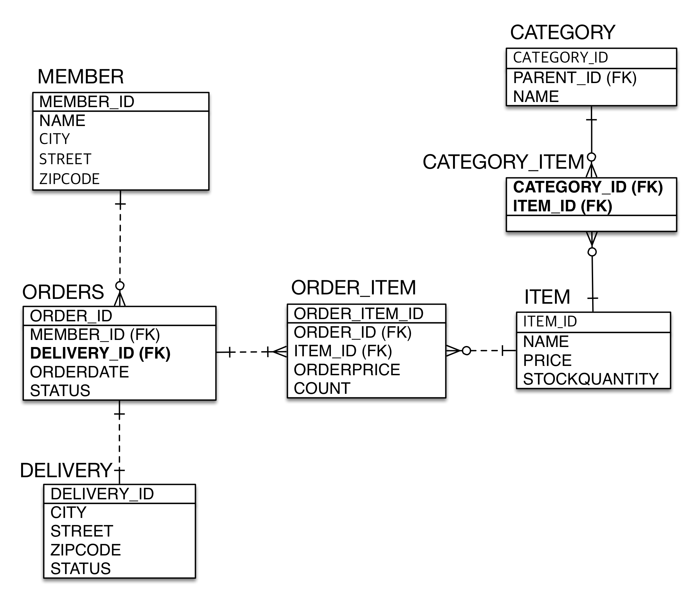

# 테이블 구조

# 객체 구조

DROP TABLE IF EXISTS CATEGORY;
DROP TABLE IF EXISTS CATEGORY_ITEM;
DROP TABLE IF EXISTS DELIVERY;
DROP TABLE IF EXISTS ITEM;
DROP TABLE IF EXISTS MEMBER;
DROP TABLE IF EXISTS ORDERITEM;
DROP TABLE IF EXISTS ORDERS;